# 🎮 Tarea 9 – Juegos Clásicos en Python con Docker

Este proyecto corresponde a la **Tarea 9** de la asignatura **Sistemas Digitales III**, donde se desarrollaron tres juegos clásicos en Python usando Pygame: **Naves**, **Tanques** y **Tetris**. Cada uno fue estructurado en su propia carpeta, con entorno virtual independiente y contenedor Docker funcional.

---

## 📁 Estructura de Carpetas

```bash
Tarea_9/
├── naves/
│   ├── main.py
│   ├── assets/
│   │   ├── images/
│   │   └── sounds/
│   ├── venv/
│   └── Dockerfile
├── tanques/
│   ├── main.py
│   ├── assets/
│   ├── venv/
│   └── Dockerfile
├── tetris/
│   ├── main.py
│   ├── assets/
│   ├── venv/
│   └── Dockerfile
└── Imagenes/
```

---

## ✅ 1. Activación de entorno virtual y dependencias

Se creó un entorno virtual por juego y se instaló `pygame==2.5.2`.

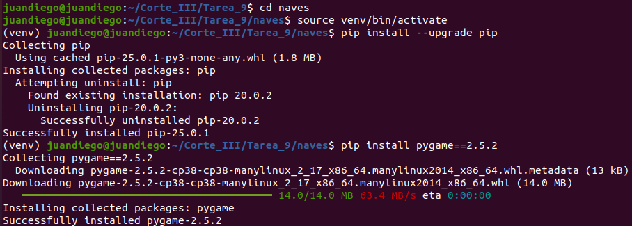

---

## ⬇️ 2. Clonación y preparación del código

Se utilizó `sparse-checkout` para clonar solo las carpetas requeridas desde GitHub.

- **Naves**  
  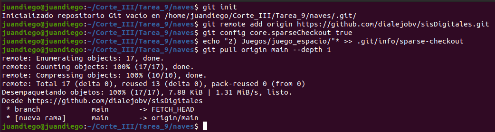

- **Tanques**  
  

- **Tetris**  
  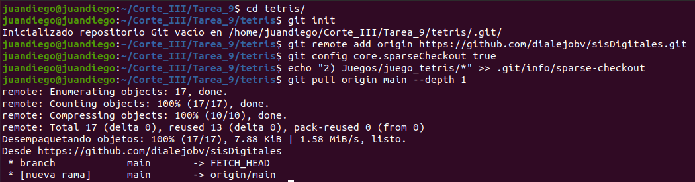

---

## 🎨 3. Creación de imágenes y sonidos

Las imágenes fueron creadas con **ImageMagick** y los sonidos con **Sox**.

- **Instalaciones**  
  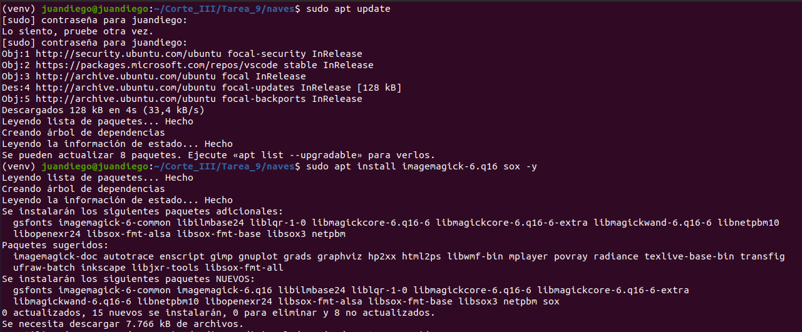  
  

- **Imágenes**  
  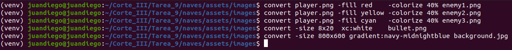  
  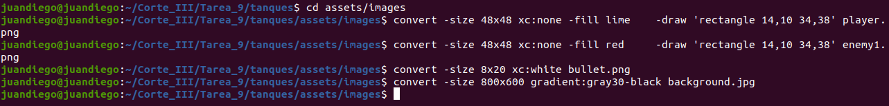  
  

- **Audios**  
  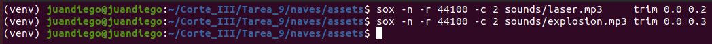  
  

---

## 📁 4. Organización de Carpetas

Se reubicaron correctamente los archivos y recursos multimedia.

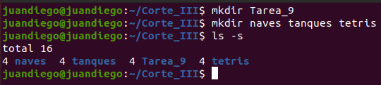

---

## ▶️ 5. Verificación de código y ejecución

Cada juego fue ejecutado exitosamente desde su entorno virtual.

- **Movimiento en Código Naves**  
  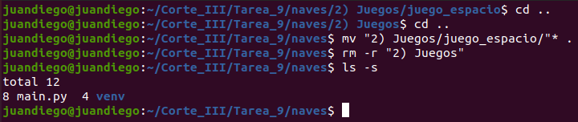

- **Movimiento Tanques**  
  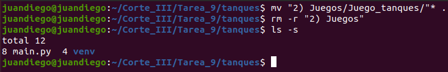

- **Movimiento Tetris**  
  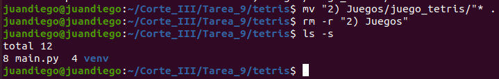

- **Vista de Código Naves**  
  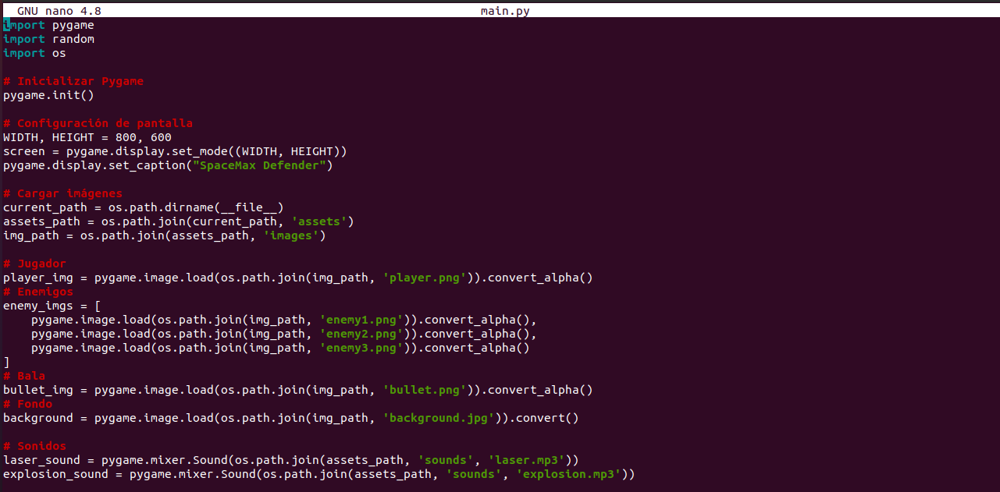

- **Vista de Código Tanques**  
  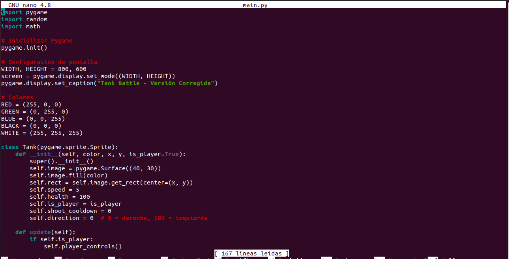

- **Vista de Código Tetris**  
  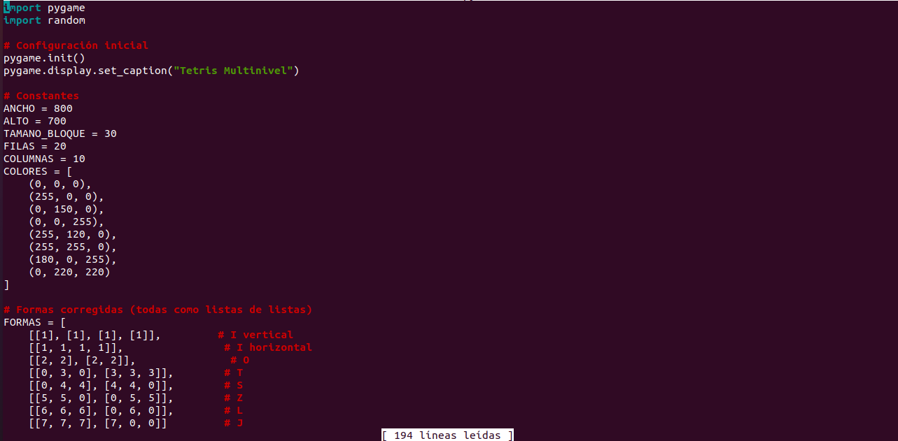

- **Ejecución Naves**  
  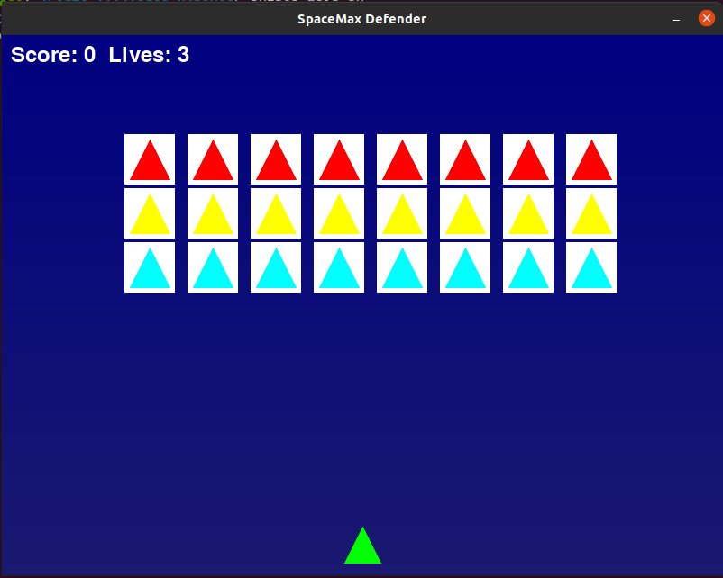

- **Ejecución Tanques**  
  

- **Ejecución Tetris**  
  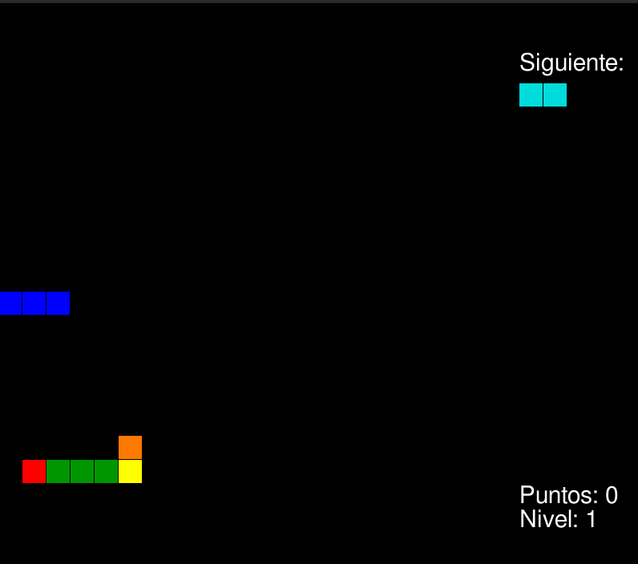

---

## 🐳 6. Creación de Dockerfile por juego

- **Dockerfile Naves**  
  

- **Dockerfile Tanques**  
  

- **Dockerfile Tetris**  
  

---

## 📦 7. Construcción de Imágenes Docker

Cada imagen Docker fue construida exitosamente.

- **Naves**  
  

- **Tanques**  
  

- **Tetris**  
  

---

## 🚀 8. Ejecución desde contenedor Docker

Cada contenedor fue ejecutado y el juego funcionó correctamente.

- **Contenedor Naves**  
  

- **Contenedor Tanques**  
  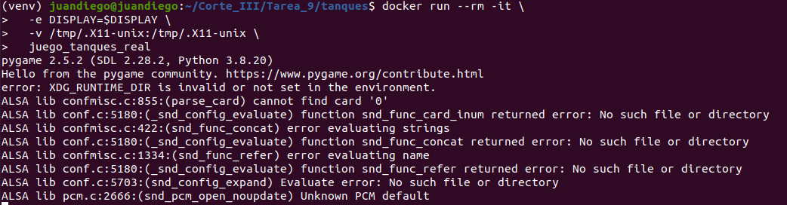

- **Contenedor Tetris**  
  

---

## 🧠 Conclusiones

Esta tarea permitió consolidar:

- La organización modular de proyectos en Python.
- La creación manual de recursos gráficos y sonoros.
- El uso de `venv` para entornos aislados.
- La construcción de contenedores Docker con interfaz gráfica (`pygame`).
- La ejecución portátil y estandarizada de videojuegos.

