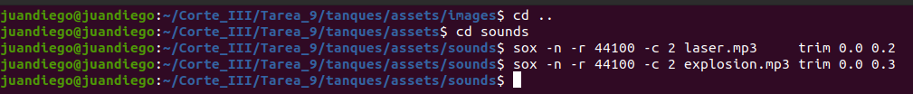
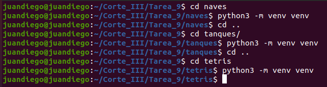
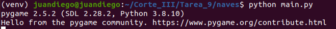
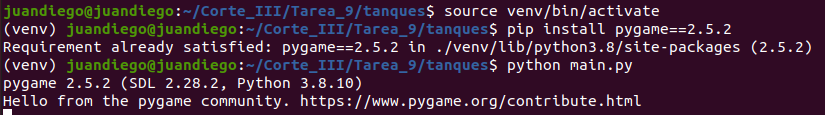
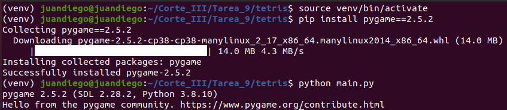
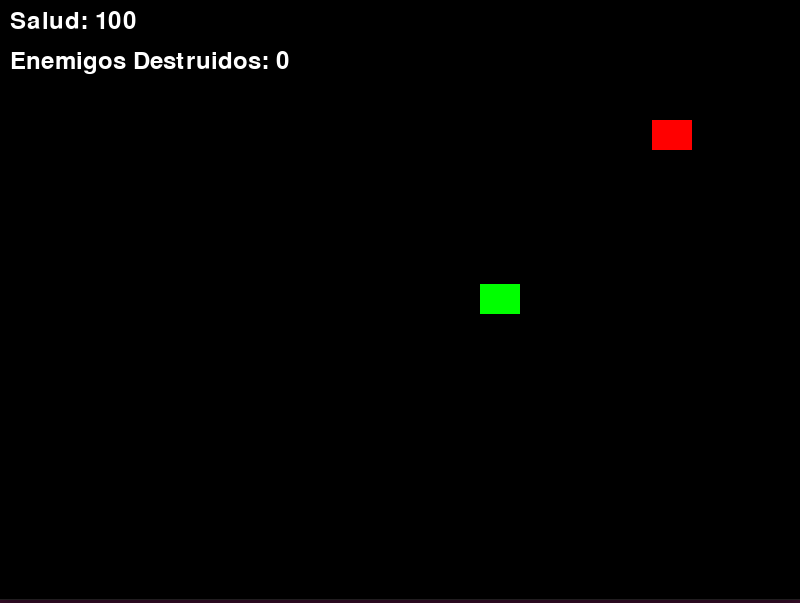

# 🎮 Tarea 9 – Juegos Clásicos en Python con Docker

Este proyecto corresponde a la Tarea 9 de la asignatura **Sistemas Digitales III**, en el cual se desarrollaron tres juegos clásicos (Naves, Tanques y Tetris) utilizando **Python con Pygame** y se empaquetaron usando **Docker**.

---

## 📁 Estructura del Proyecto

```plaintext
Tarea_9/
├── naves/
│   ├── main.py
│   ├── assets/
│   │   ├── images/
│   │   └── sounds/
│   ├── venv/
│   └── Dockerfile
├── tanques/
│   ├── main.py
│   ├── assets/
│   ├── venv/
│   └── Dockerfile
├── tetris/
│   ├── main.py
│   ├── assets/
│   ├── venv/
│   └── Dockerfile
└── Imagenes/
```

---

## ✅ 1. Activación del entorno virtual

Se crearon entornos virtuales independientes por juego usando `python3 -m venv`.


---

## 🧩 2. Clonación de los juegos desde GitHub

Se utilizó **sparse-checkout** para clonar solo las carpetas requeridas desde GitHub.

### Naves


### Tanques


### Tetris


---

## 🖼️ 3. Creación de imágenes y sonidos

Se empleó **ImageMagick** para generar imágenes y **sox** para crear sonidos de efectos.

### Instalación de paquetes:


### Imágenes del juego Naves:


### Sonidos del juego Naves:


### Imágenes del juego Tanques:


### Sonido del juego Tanques:


### Imagen Tetris:


---

## 📦 4. Organización de carpetas

Se reubicaron correctamente los archivos fuente a sus carpetas correspondientes.




---

## 🧪 5. Verificación del código

Los tres juegos fueron verificados y corren correctamente desde su entorno.

### Nave:


### Tanques:


### Tetris:


---

## 🐳 6. Dockerfile por juego

Cada juego cuenta con su `Dockerfile` propio para crear imágenes portables.

### Naves:


### Tanques:


### Tetris:


---

## 🛠️ 7. Creación de imágenes Docker

Se construyeron las imágenes Docker para cada juego:

### Imagen de Naves:


### Imagen de Tanques:


### Imagen de Tetris:


---

## ▶️ 8. Ejecución desde contenedores

Cada juego fue ejecutado desde Docker. Se solucionaron errores comunes como:

- Variables de entorno `XDG_RUNTIME_DIR`
- Error con `mixer not initialized`
- Permisos de acceso al entorno gráfico

### Juego Naves


### Juego Tanques


### Juego Tetris


---

## 🧠 9. Código fuente y lógica

Incluye estructura, imágenes y sonidos cargados correctamente.

### Naves:


### Tanques:


### Tetris:


---

## 📌 Conclusiones

- Se consolidó el uso de entornos virtuales y su aislamiento.
- Se manejaron herramientas como `git sparse-checkout`, `ImageMagick` y `sox`.
- Se empaquetaron tres juegos completos usando Docker, solucionando problemas reales de dependencias y sonido.
- Se logró ejecutar gráficamente Pygame dentro de contenedores con recursos de sistema compartidos.

---