# 🎮 Tarea 9 – Juegos Clásicos en Python con Docker

Este proyecto corresponde a la **Tarea 9** de la asignatura **Sistemas Digitales III**, donde se desarrollaron tres juegos clásicos en Python usando Pygame: **Naves**, **Tanques** y **Tetris**. Cada uno fue estructurado en su propia carpeta, con entorno virtual independiente y contenedor Docker funcional.

---

## 📁 Estructura de Carpetas

```bash
Tarea_9/
├── naves/
│   ├── main.py
│   ├── assets/
│   │   ├── images/
│   │   └── sounds/
│   ├── venv/
│   └── Dockerfile
├── tanques/
│   ├── main.py
│   ├── assets/
│   ├── venv/
│   └── Dockerfile
├── tetris/
│   ├── main.py
│   ├── assets/
│   ├── venv/
│   └── Dockerfile
└── Imagenes/
```

---

## ✅ 1. Activación de entorno virtual y dependencias

Se creó un entorno virtual con `venv` y se instaló `pygame==2.5.2`. En la imagen se puede observar el proceso completo para el juego de naves:


---

## ⬇️ 2. Clonación y preparación del código

Se utilizó `sparse-checkout` para clonar solo las carpetas necesarias desde GitHub, evitando descargas innecesarias.

- **Clonación Naves**  
  

- **Clonación Tanques**  
  

- **Clonación Tetris**  
  

---

## 🎨 3. Creación de imágenes y sonidos

Para generar las imágenes se utilizó **ImageMagick**, y los sonidos fueron creados con **Sox**.

- **Instalación de herramientas**  
    
  

- **Imágenes Naves**: Se generaron manualmente el jugador, los enemigos y el fondo.  
  

- **Imágenes Tanques**: Se usaron rectángulos de distintos colores para el jugador, enemigos y balas.  
  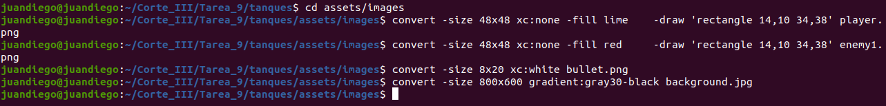

- **Imágenes Tetris**: Se usó un degradado para el fondo.  
  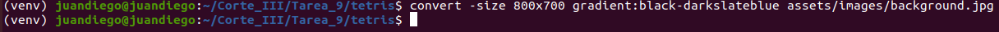

- **Audios Naves**: Creación del láser y la explosión.  
  

- **Audios Tanques**: Sonidos simples de prueba para acciones del juego.  
  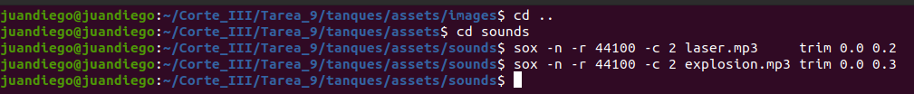

---

## 📁 4. Organización de Carpetas

Después de clonar, los archivos se reorganizaron en sus respectivas carpetas (naves, tanques, tetris).


---

## ▶️ 5. Verificación de código y ejecución

Se validó el funcionamiento del código con `main.py` dentro de cada carpeta.

- **Movimiento Naves**  
  

- **Movimiento Tanques**  
  

- **Movimiento Tetris**  
  

- **Vista general del código Naves**  
  

- **Vista general del código Tanques**  
  

- **Vista general del código Tetris**  
  

- **Juego Naves corriendo**  
  

- **Juego Tanques corriendo**  
  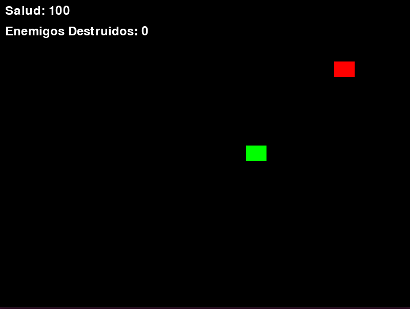

- **Juego Tetris corriendo**  
  

---

## 🐳 6. Creación de Dockerfile por juego

Se crearon Dockerfiles específicos por cada juego para contenerizar la aplicación.

- **Dockerfile Naves**  
  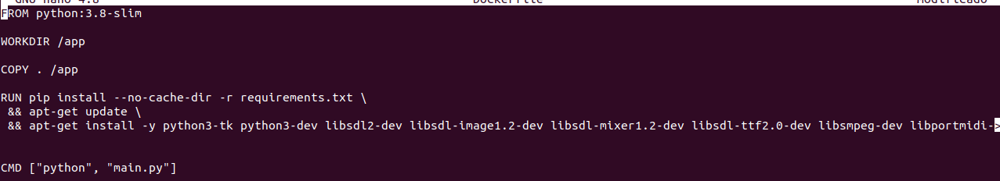

- **Dockerfile Tanques**  
  

- **Dockerfile Tetris**  
  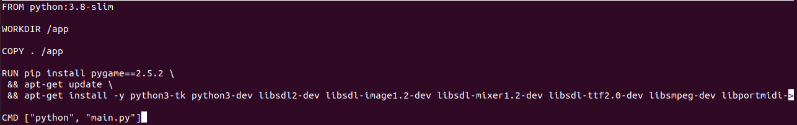

---

## 📦 7. Construcción de Imágenes Docker

Cada imagen fue construida correctamente usando `docker build`.

- **Imagen Naves**  
  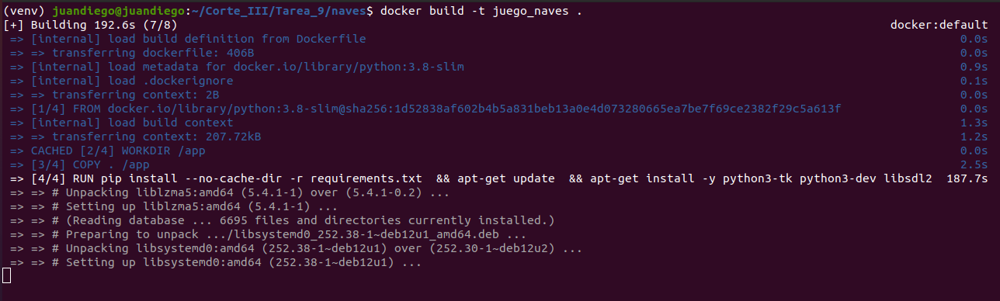

- **Imagen Tanques**  
  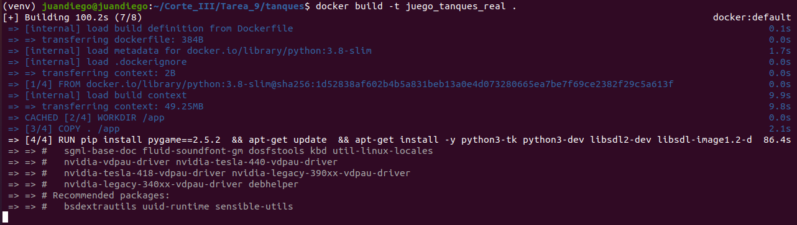

- **Imagen Tetris**  
  

---

## 🚀 8. Ejecución desde contenedor Docker

Se ejecutaron los contenedores con soporte gráfico para ver el juego corriendo desde Docker.

- **Contenedor Naves**  
  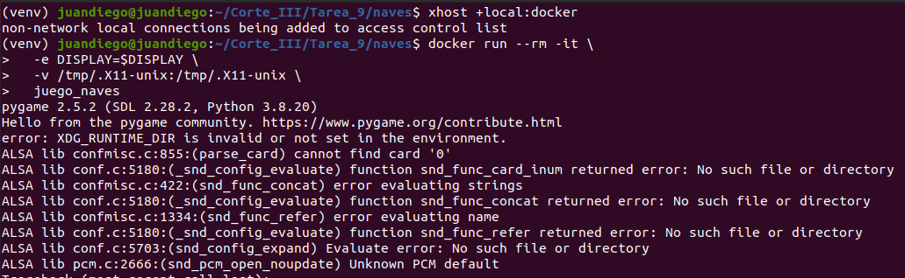

- **Contenedor Tanques**  
  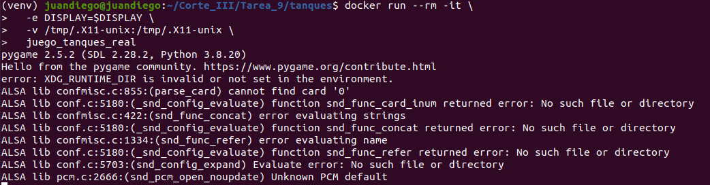

- **Contenedor Tetris**  
  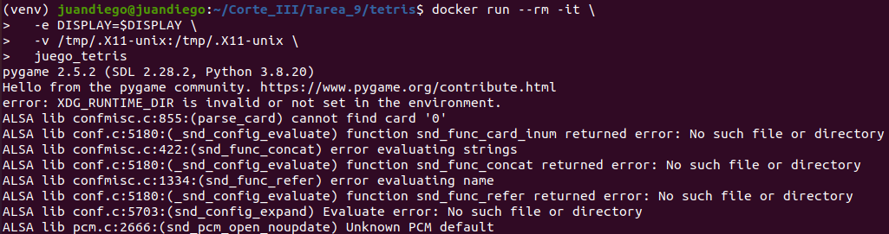

---

## 🧠 Conclusiones

Esta tarea permitió consolidar:

- La estructura modular de videojuegos en Python.
- La creación de recursos gráficos y sonoros desde cero.
- El uso de entornos virtuales (`venv`).
- La construcción y ejecución de contenedores Docker con interfaz gráfica.

